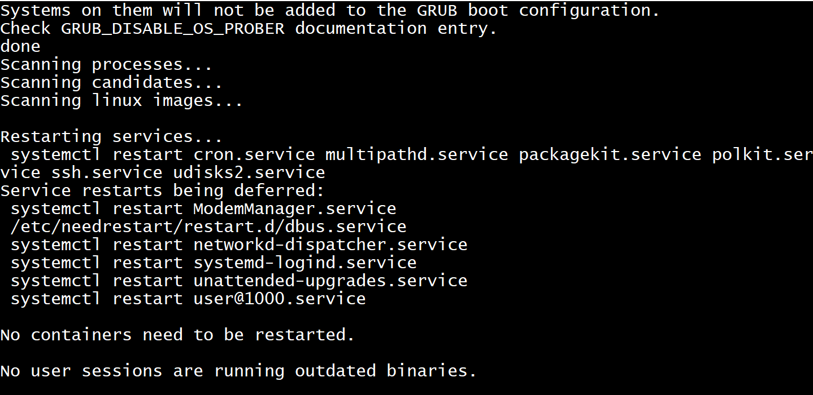
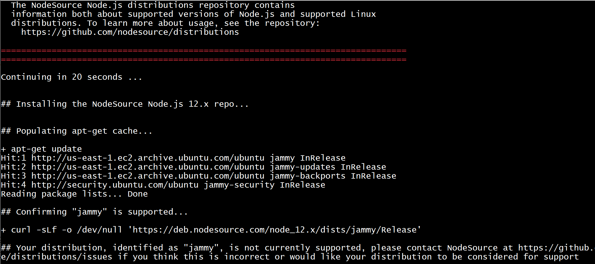
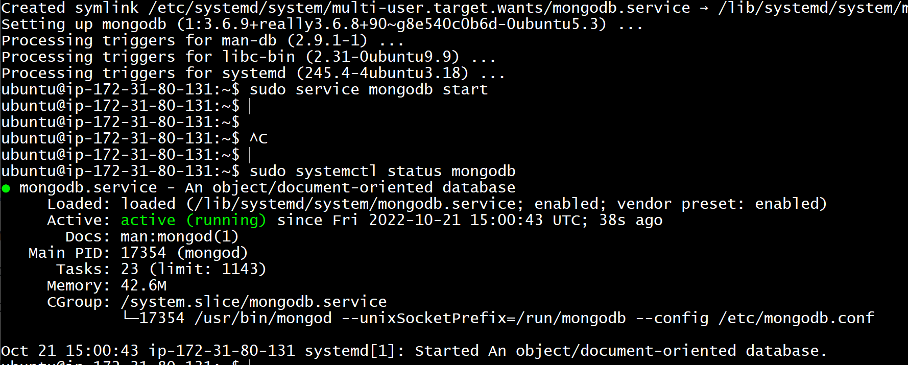
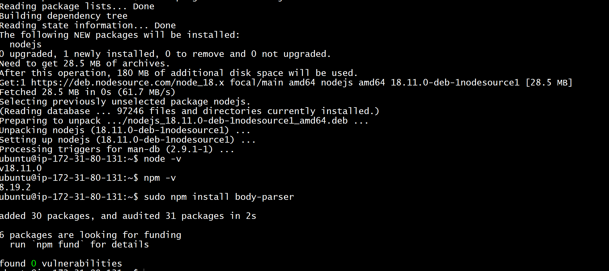
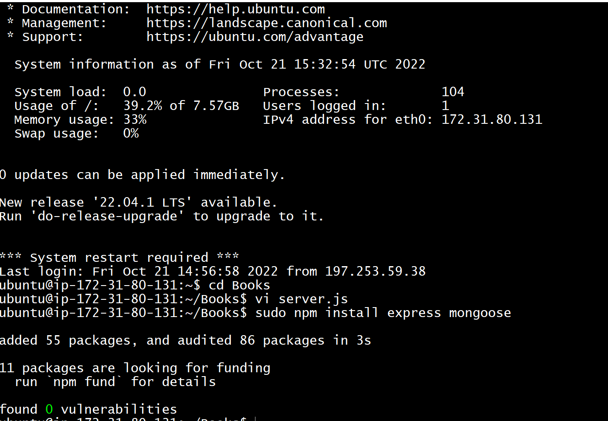
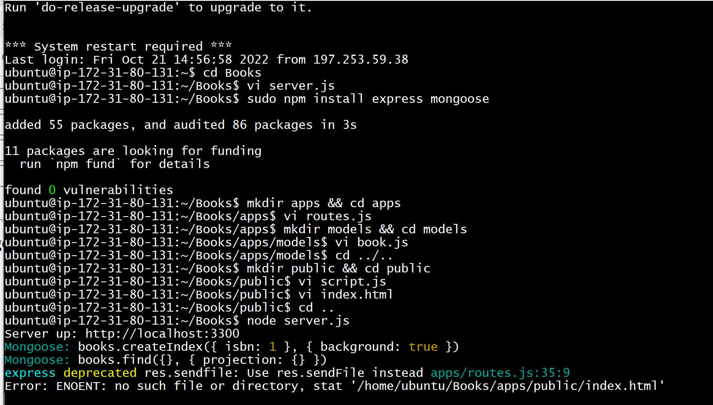
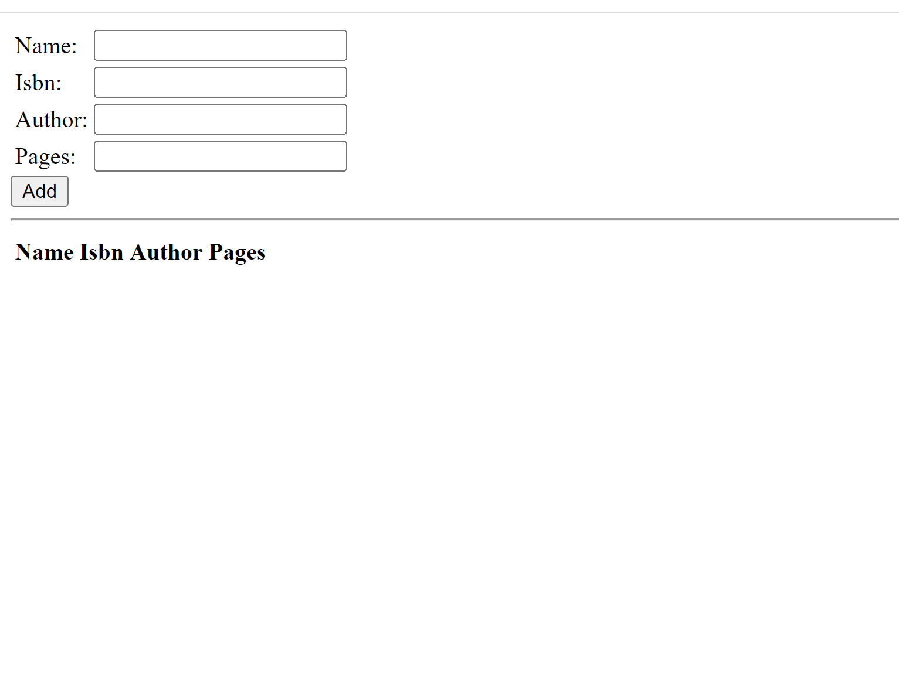

# Step Guide  to setup MEAN STACK

## Step 1: setup AWS EC 2 instance and manage ubuntu updates and upgrade from GIT bash using the scripts below

`sudo apt update`

`sudo apt upgrade`

## Add certificates using the script below, then install nodejs using the scripts after the attached screenshot

`sudo apt -y install curl dirmngr apt-transport-https lsb-release ca-certificates`

`curl -sL https://deb.nodesource.com/setup_12.x | sudo -E bash -`

`sudo apt install -y nodejs`

## Step 2: Install MongoDB using the scripts below and also confirm service is running, please ensure the right ubuntu version is used for the mongodb to be installed

`sudo apt-key adv --keyserver hkp://keyserver.ubuntu.com:80 --recv 0C49F3730359A14518585931BC711F9BA15703C6`

`echo "deb [ arch=amd64 ] https://repo.mongodb.org/apt/ubuntu trusty/mongodb-org/3.4 multiverse" | sudo tee /etc/apt/sources.list.d/mongodb-org-3.4.list`

`sudo apt install -y mongodb`

`sudo service mongodb start`

## You do not need to install npm when installing nodejs from nodesource, as it already includes npm, run the scripts below

`curl -fsSL https://deb.nodesource.com/setup_18.x | sudo -E bash -`

`sudo apt-get install nodejs`

## install the body parser package using the script

`sudo npm install body-parser`

## create a folder named book and navigate to the directory using the command below

`mkdir Books && cd Books`

## initialize the npm project using the directory below

`npm init`

## add a file named serverJs

## step 3: install Express and set up routes to the server

## setup mongoose to setup schema for the database

`sudo npm install express mongoose`

## from the books folder create an app file and paste a javascript file in it

`mkdir apps && cd apps`

## in the apps, create a folder called models and add a new file called bookjs

## Step 4: access the routes with AngularJs

## update the necessary html files and start the node server by running the script below:

`node server.js`

